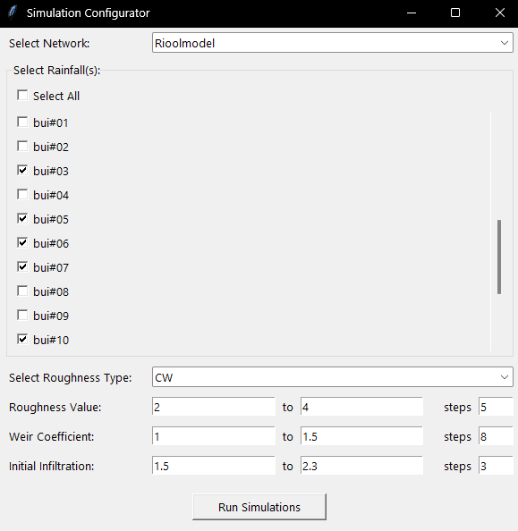

# InfoWorks ICM Data Generator

## Required programs
Make sure that the following programs are installed and have a valid license:

- InfoWorks ICM Ultimate
- Python
- Ruby

And make sure to follow the instructions for your database [here](https://github.com/JorenHessels/infoworks-data-generator/blob/main/database/README.md)

## How to use
Make sure to navigate to the root of this directory before starting the application. Once you have navigated to the root of the directory, you can start the application by running:

```python .\gui_app\main.py``` 

It may take a while to show anything because it is retrieving data int the background

Once the initial processing is complete, you can customize the parameters of the simulations that will be run.

The UI can be seen below



The first box is for choosing which network the simulations will use. The selection box below where you can select which rainfalls to use for the simulations. There is also an option to choose which roughness type the values underneath it apply to, the choices are: CW, HW, Mannings, N. The range fields underneath that are for specifying the values that the other parameters can take, namely roughness value, weir discharge coefficient and initial infiltration. These are all specified in a minimum and a maximum, with a number of steps in between these values (both min and max are inclusive).


## Dataset
The benchmark dataset that accompanies this project can be found [here](https://huggingface.co/datasets/joren-h/wastewater-benchmark).
The dataset contains simulations off the following parameters:
- 10 standard rainfall events.
- Conduit: Colebrook-White(CW) (Top- and Bottom-) Roughness with values from 0.25 to 8.0, with steps of 0.25 in between (32 steps).
- Weir: Discharge Coefficient of 0.2 to 2.0 with steps of 0.2 in between (10 steps).
- Runoff Surface: Initial Infiltration with values from 2 to 100 with steps of 14 in between (8 steps).